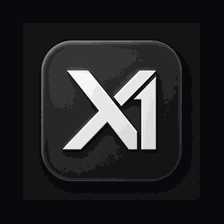
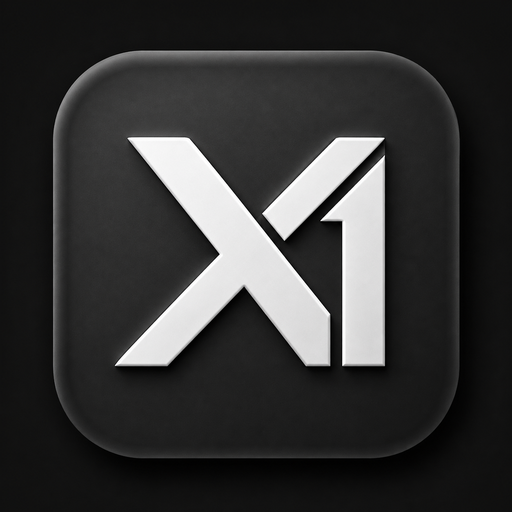

<p align="center">
  
</p>

<h1 align="center">XOne</h1>

<p align="center">
  <strong>The local AI control plane for models, knowledge, agents, and production workflows.</strong>
</p>

<p align="center">
  <a href="https://github.com/abhishekpandaOfficial/XOne/releases/latest">Download Desktop</a> ·
  <a href="https://github.com/abhishekpandaOfficial/XOne/actions">Build Status</a> ·
  <a href="https://github.com/abhishekpandaOfficial/XOne/issues">Support</a>
</p>

<p align="center">
  
  
  
  
</p>

<p align="center">
  <code>LOCAL-FIRST</code>&nbsp;&nbsp; <code>MODEL-AGNOSTIC</code>&nbsp;&nbsp; <code>MCP-READY</code>&nbsp;&nbsp; <code>OPENAI-COMPATIBLE</code>
</p>

XOne brings local inference, private knowledge retrieval, Model Context Protocol
(MCP) tools, training, export, and OpenAI-compatible serving into one observable
workspace. **X1** is the compact mark; **XOne** is the product.

<p align="center">
  
  <br />
  <sub>One workspace. Observable local intelligence.</sub>
</p>

## Technology Stack

<p>
  
  
  
  
  
  
  
  
  
</p>

| Domain             | Stack                                                             |
| ------------------ | ----------------------------------------------------------------- |
| Web and desktop UI | React 19, TypeScript, Vite, Tailwind CSS, TanStack Router, Motion |
| Native application | Tauri 2, Rust, operating-system WebView                           |
| Control plane      | Python, FastAPI, Uvicorn, Pydantic, JWT, SQLite                   |
| Model execution    | Transformers, llama.cpp / GGUF, MLX on Apple Silicon              |
| Delivery           | Vercel portal, GitHub Actions, GitHub Releases                    |

## Product Surface

| Capability             | What it provides                                                                                        |
| ---------------------- | ------------------------------------------------------------------------------------------------------- |
| **Local inference**    | Hardware-aware model loading, GGUF workflows, chat, vision, audio, and video capabilities.              |
| **Model operations**   | Discover, download, inspect, load, unload, and monitor models from one hub.                             |
| **Private knowledge**  | Prepare documents and datasets for retrieval-augmented generation (RAG) with grounded context.          |
| **MCP and agents**     | Connect coding agents and approved tools through explicit, reviewable capability boundaries.            |
| **Training**           | Build datasets, run LoRA or QLoRA workflows, track metrics, and evaluate outputs.                       |
| **Export and serving** | Export deployable artifacts and expose local models through an OpenAI-compatible API.                   |
| **Desktop runtime**    | X1-Studio manages the local backend and keeps model, credential, and runtime state close to the device. |

## Download XOne Desktop

The latest release provides installers for the supported platforms:

| Platform            | Package                                                                                                                     |
| ------------------- | --------------------------------------------------------------------------------------------------------------------------- |
| macOS Apple Silicon | [Download DMG](https://github.com/abhishekpandaOfficial/XOne/releases/latest/download/XOne-Desktop-macOS-Apple-Silicon.dmg) |
| macOS Intel         | [Download DMG](https://github.com/abhishekpandaOfficial/XOne/releases/latest/download/XOne-Desktop-macOS-Intel.dmg)         |
| Windows x64         | [Download installer](https://github.com/abhishekpandaOfficial/XOne/releases/latest/download/XOne-Desktop-Windows-x64.exe)   |
| Debian / Ubuntu x64 | [Download DEB](https://github.com/abhishekpandaOfficial/XOne/releases/latest/download/XOne-Desktop-Linux-x64.deb)           |
| Linux x64           | [Download AppImage](https://github.com/abhishekpandaOfficial/XOne/releases/latest/download/XOne-Desktop-Linux-x64.AppImage) |

Verify downloads with the published [SHA256SUMS.txt](https://github.com/abhishekpandaOfficial/XOne/releases/latest/download/SHA256SUMS.txt).

### Installation

- **macOS:** Open the DMG and drag `XOne.app` to Applications. Alpha builds may require **System Settings → Privacy & Security → Open Anyway**.
- **Windows:** Run the x64 installer. Review the SmartScreen warning and verify the checksum before continuing.
- **Debian / Ubuntu:** `sudo apt install ./XOne-Desktop-Linux-x64.deb`
- **Linux AppImage:** `chmod +x XOne-Desktop-Linux-x64.AppImage && ./XOne-Desktop-Linux-x64.AppImage`

## Quickstart

### macOS, Linux, and WSL

```bash
curl -fsSL https://raw.githubusercontent.com/abhishekpandaOfficial/XOne/main/install.sh | sh
xone studio
```

### Windows PowerShell

```powershell
irm https://raw.githubusercontent.com/abhishekpandaOfficial/XOne/main/install.ps1 | iex
xone studio
```

The local service listens on `127.0.0.1:8888` by default. For a secure API-only session:

```bash
xone studio --api-only --secure -p 8888
```

Useful local endpoints:

- Health: `http://127.0.0.1:8888/api/health`
- OpenAPI: `http://127.0.0.1:8888/openapi.json`
- Swagger UI: `http://127.0.0.1:8888/docs`
- ReDoc: `http://127.0.0.1:8888/redoc`

## Models

XOne supports a model workflow built around the task, hardware, and context window:

1. Search the model hub or import a compatible local checkpoint.
2. Start with a smaller chat or instruct model while validating prompts and data.
3. Use quantization and runtime selection appropriate to the host hardware.
4. Keep model identity, residency, loading state, and request activity observable.
5. Scale to a larger or multimodal model when quality and context requirements justify it.

Model files remain on the configured local cache unless the operator explicitly
chooses another storage or provider boundary.

## MCP and Agents

MCP lets an agent call focused tools such as documentation search, repositories,
files, or data systems. XOne keeps this integration explicit:

```bash
xone start claude
xone start codex
xone start opencode
```

Start with read-only servers, review tool permissions, keep credentials in the
local credential store, and enable only the servers required by a workspace.
The XOne Docs MCP preset is available from the MCP controls inside the workspace.

## RAG and Private Knowledge

RAG is a controlled pipeline, not a model setting:

1. **Ingest:** collect authoritative PDFs, DOCX files, CSVs, URLs, or project data.
2. **Prepare:** normalize content, preserve metadata, and define access scope.
3. **Retrieve:** select the smallest relevant context for the request.
4. **Generate:** answer with source-aware context and citations where available.
5. **Evaluate:** measure retrieval quality, answer quality, latency, and drift independently.

Keep sensitive sources local, separate tenant or project indexes, and avoid
sending retrieved context to an external provider unless that boundary is deliberate.

## Training and Export

XOne supports a practical local lifecycle:

- Prepare and validate datasets with explicit splits and schemas.
- Use **LoRA** for efficient adapter training and **QLoRA** for lower-memory workflows.
- Inspect training loss, evaluation behavior, checkpoints, and reproducibility metadata.
- Export adapters, merged checkpoints, or GGUF artifacts for the target runtime.
- Validate the exported artifact through the local chat and API paths before deployment.

## API and Operations

XOne exposes native `/api/*` endpoints and OpenAI-compatible `/v1/*` endpoints.
A minimal local request looks like this:

```bash
curl http://127.0.0.1:8888/v1/chat/completions \\
  -H 'Content-Type: application/json' \\
  -d '{"model":"local-model","messages":[{"role":"user","content":"Hello"}]}'
```

Recommended production controls:

- Keep the service on loopback unless network access is required.
- Use HTTPS, authentication, strict CORS, and host policy for remote access.
- Treat MCP tools and retrieved documents as separate security boundaries.
- Do not place secrets in `VITE_*` variables or public frontend configuration.
- Monitor health, request activity, model residency, latency, and resource usage.
- Do not deploy the model runtime as a short-lived serverless function.

## Architecture

```text
X1-Studio Desktop / XOne Web Portal
                |
          React + Vite UI
                |
       Local FastAPI control plane
       /api/*          /v1/*
                |
  Model runtimes · RAG · MCP · Training · Export
```

| Layer          | Technology                                                       |
| -------------- | ---------------------------------------------------------------- |
| Web interface  | React, TypeScript, Vite, Tailwind CSS, TanStack Router, Motion   |
| Desktop shell  | Tauri 2 and Rust                                                 |
| Backend        | Python, FastAPI, Uvicorn, Pydantic, JWT, SQLite                  |
| Model runtimes | Transformers, llama.cpp / GGUF, MLX on Apple Silicon             |
| Delivery       | Vercel for the portal and GitHub Releases for desktop installers |

## Development

```bash
# Frontend
cd studio/frontend
npm ci
npm run dev -- --port 5173 --strictPort

# Validation
npm run typecheck
npm run build
npm test

# Native desktop development
cd ..
npx --yes @tauri-apps/cli@2.10.1 dev
```

Run backend development from the repository root with:

```bash
./.venv/bin/xone studio --api-only -H 127.0.0.1 -p 8888
```

Pull requests should include a concise change description, focused tests, and
screenshots for user-facing changes. Keep credentials, model weights, generated
binaries, and machine-specific state out of commits.

## Repository Structure

```text
xone/
├── studio/frontend/       React web and desktop interface
├── studio/backend/        FastAPI control plane and runtime services
├── studio/src-tauri/      Tauri shell, icons, and native packaging
├── Python CLI package/     xone command implementation and compatibility layer
├── tests/                  Integration, security, and regression tests
├── scripts/                Build, packaging, and verification utilities
└── .github/workflows/      CI and desktop release automation
```

## Releases

Desktop releases are built by the **Release XOne Desktop Alpha** workflow. Each
release must publish all platform packages and `SHA256SUMS.txt`. The portal uses
stable latest-release asset paths, so a new desktop release does not require a
frontend version edit.

Before a production release, configure Apple Developer ID signing and notarization,
a trusted Windows certificate, release monitoring, and a documented rollback plan.

## License and Notices

See [LICENSE](LICENSE), [COPYING](COPYING), and
[studio/LICENSE.AGPL-3.0](studio/LICENSE.AGPL-3.0) for the applicable license terms
and notices. Review component-specific notices before redistributing builds.

<footer>
  XOne includes open-source components and technical foundations originally developed with Unsloth AI. See the repository notices for attribution and licensing details.
</footer>
